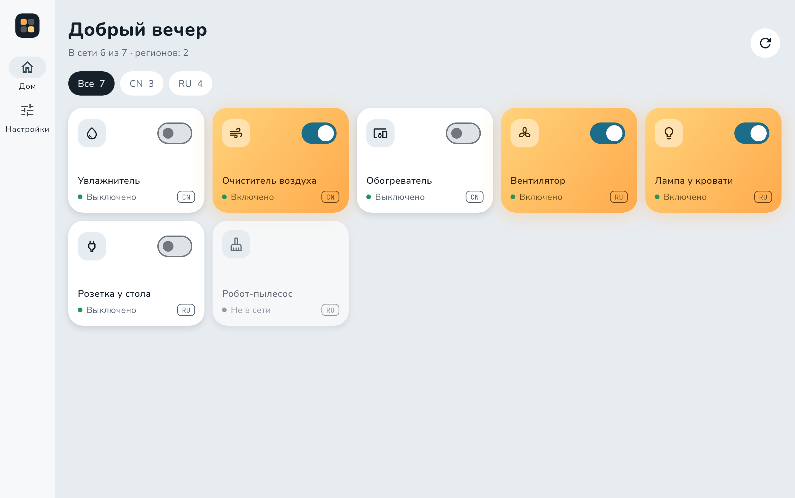
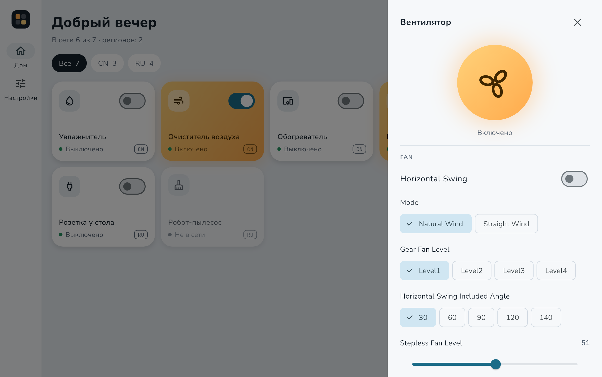
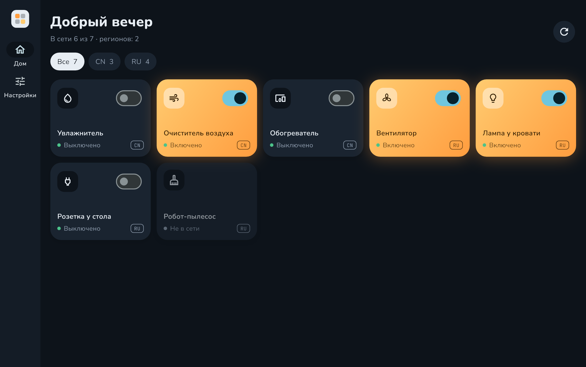
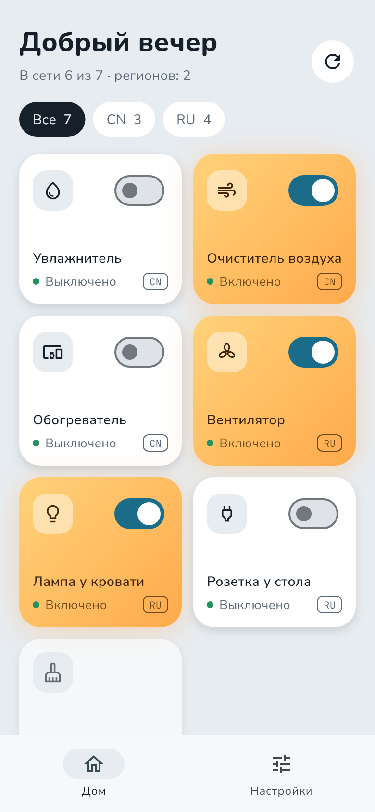
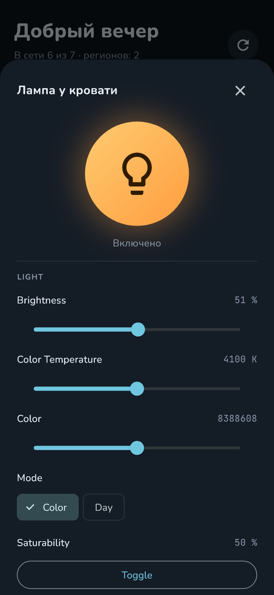
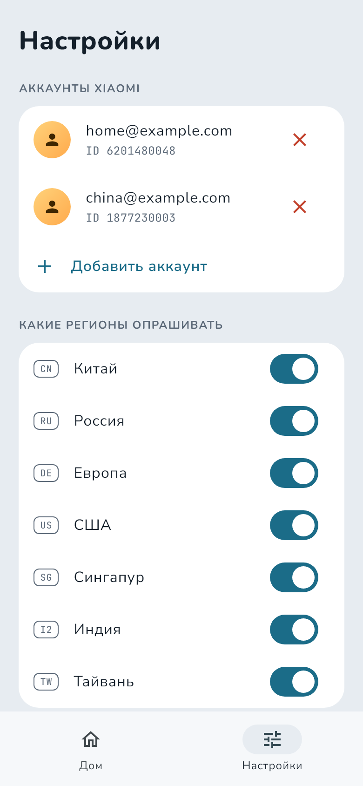
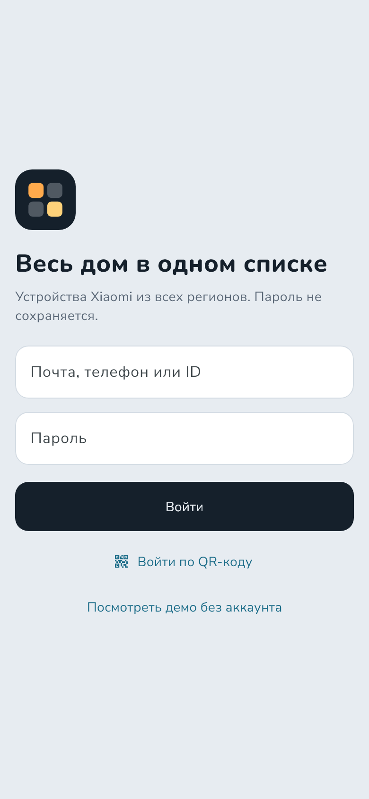
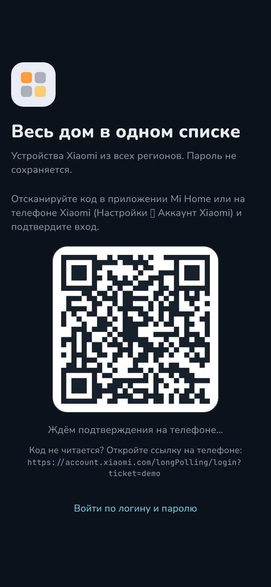

# Home Assist

[](https://github.com/Hecatoncheir/home_assist/actions/workflows/ci.yml)

Приложение для управления устройствами Xiaomi / Mijia под Windows, macOS, Linux,
Android и iOS. Главное отличие от Mi Home — **устройства из всех регионов
и всех аккаунтов в одном списке**: например, привязанные к серверам «Россия»
и «Китай» видны и управляются одновременно, без переключения региона.



| Панель устройства строится из его спецификации | Тёмная тема |
| --- | --- |
|  |  |

| Дом на телефоне | Настройки лампы | Несколько аккаунтов |
| --- | --- | --- |
|  |  |  |

| Вход по паролю | Вход по QR-коду |
| --- | --- |
|  |  |

Скриншоты сняты в демо-режиме: устройства и аккаунты выдуманы, QR-код —
картинка-пример.

> **Состояние проекта.** Это ранняя версия. Подпись запросов, разбор
> спецификаций, список устройств и интерфейс покрыты тестами, но вход
> в настоящий аккаунт Xiaomi — по паролю, с кодом подтверждения и по QR-коду —
> пока не проверен на практике. Приложение неофициальное и не связано с Xiaomi.

## Возможности

- **Все регионы сразу.** Серверы `cn`, `ru`, `de`, `us`, `sg`, `i2`, `tw`
  опрашиваются параллельно. Если один не ответил, остальные всё равно
  показываются, а про недоступный регион будет отдельная строка
  с кнопкой «Повторить».
- **Несколько аккаунтов.** Устройства всех аккаунтов собираются в один
  список; устройство с общим доступом показывается один раз.
- **Включённое видно с одного взгляда.** Плитка работающего устройства
  светится тёплым, выключенного — остаётся холодной, недоступного — тускнеет.
- **Управление без ручной настройки.** Панель устройства строится
  из его спецификации MIoT: переключатели, выбор режима, ползунки, значения
  датчиков, кнопки действий.
- **Два способа входа.** По логину и паролю или по QR-коду из Mi Home —
  тогда пароль вводить не нужно.
- **Свой порядок плиток.** Плитки перетаскиваются, порядок запоминается.
- **Фильтры** по региону и по аккаунту.
- **Любой размер экрана.** На телефоне — две колонки и нижняя панель,
  на широком экране — боковая панель, а устройство открывается справа.
- **Светлая и тёмная тема**, по умолчанию как в системе.
- **Пароль не сохраняется.** В системном хранилище секретов лежат только
  сессии; удаление аккаунта удаляет и его сессию.

## Попробовать без аккаунта

На экране входа нажмите **«Посмотреть демо без аккаунта»**. Откроется дом
с выдуманными устройствами: их можно включать, настраивать и перетаскивать.
Команды никуда не отправляются. Интернет нужен только для загрузки описаний
устройств с miot-spec.org.

## Установка

Готовые сборки будут прикладываться к [релизам](https://github.com/Hecatoncheir/home_assist/releases).
Пока релизов нет, сборки можно скачать на вкладке
[Actions](https://github.com/Hecatoncheir/home_assist/actions/workflows/ci.yml):
откройте запуск со сборками и загляните в раздел Artifacts (нужен вход в GitHub).

| Платформа | Файл | Как запустить |
| --- | --- | --- |
| Windows | `home_assist-windows-x64.zip` | Распаковать, запустить `home_assist.exe` |
| Linux | `home_assist-linux-x64.tar.gz` | Распаковать, запустить `home_assist`; нужен `libsecret` |
| macOS | `home_assist-macos.zip` | Распаковать; приложение не подписано, первый запуск — через правый щелчок → «Открыть» |
| Android | `home_assist-android.apk` | Установить, разрешив установку из неизвестных источников |
| iOS | — | Только сборка из исходников со своей подписью Apple |

## Как пользоваться

### Вход

**По логину и паролю.** Введите почту, телефон или ID и пароль. Если сервер
попросит, введите текст с картинки или код из SMS или письма. Кнопка «Назад»
возвращает к вводу логина и пароля.

**По QR-коду.** Нажмите «Войти по QR-коду» и отсканируйте код в приложении
Mi Home или на телефоне Xiaomi (Настройки → Аккаунт Xiaomi), затем подтвердите
вход на телефоне. Код действует пять минут, потом можно получить новый.

### Устройства

1. **Дождитесь списка.** Устройства из всех регионов и аккаунтов появятся
   плитками. Фильтр над списком оставляет один регион или один аккаунт.
2. **Включайте и выключайте** переключателем на плитке.
3. **Нажмите на плитку**, чтобы открыть все настройки устройства.
   Пока панель открыта, состояние обновляется каждые несколько секунд.
4. **Перетащите плитку**, чтобы поменять порядок: мышью — сразу,
   на телефоне — после удержания.
5. **Обновите список** кнопкой в углу или потянув список вниз.

### Настройки

- **Аккаунты:** «Добавить аккаунт» открывает экран входа, вернуться можно
  кнопкой «К настройкам». Крестик у аккаунта убирает его вместе с его
  устройствами; сам аккаунт Xiaomi и устройства при этом не меняются.
- **Регионы:** можно отключить те, где у вас нет устройств. Изменение
  применится при следующем обновлении списка.
- **Оформление:** как в системе, светлая или тёмная тема.

### Что стоит знать заранее

- Названия настроек в панели устройства пока на английском — так они записаны
  в спецификации.
- Если для модели нет опубликованной спецификации, устройство будет в списке,
  но управлять им не получится.
- Управление идёт через облако Xiaomi. Прямое управление по Wi‑Fi в планах.

## Сборка из исходников

Нужен [Flutter](https://docs.flutter.dev/get-started/install) 3.47 или новее
и инструменты для вашей платформы (`flutter doctor` подскажет, чего не хватает).

```bash
git clone https://github.com/Hecatoncheir/home_assist.git
cd home_assist
flutter pub get
flutter run
```

Сразу открыть демо-режим, минуя экран входа:

```bash
flutter run --dart-define=DEMO=true
```

Релизная сборка:

```bash
flutter build windows --release   # или linux, macos, apk, ios
```

Для Linux дополнительно нужны пакеты
`clang cmake ninja-build pkg-config libgtk-3-dev liblzma-dev libsecret-1-dev libjsoncpp-dev`.

## Разработка

```bash
flutter analyze
flutter test
dart format lib test
```

Скриншоты для README снимаются тестом с настоящих экранов в демо-режиме,
окна и мышь при этом не используются:

```bash
SCREENSHOTS=1 flutter test test/screenshots
```

Устройство проекта:

```
lib/
  core/
    accounts/   сессии аккаунтов и их хранение
    cloud/      вход по паролю и QR-коду, подпись запросов, регионы
    spec/       загрузка и разбор спецификаций MIoT
    devices/    модель устройства, список, команды
  demo/         демо-режим с выдуманными устройствами
  ui/           экраны и тема
design/         HTML-прототип интерфейса
assets/fonts/   шрифты Nunito, Nunito Sans и JetBrains Mono
docs/           скриншоты для README
test/           тесты; сеть в них подменена, образцы спецификаций в fixtures/
```

CI на GitHub проверяет форматирование, анализатор и тесты на каждый пуш.
Сборки под все платформы запускаются по тегу или вручную (Actions → CI →
Run workflow), а тег вида `v0.1.0` ещё и публикует релиз с готовыми файлами:

```bash
git tag v0.1.0
git push origin v0.1.0
```

План работ и известные пробелы — в [TODO.md](TODO.md).

## Важно

Приложение использует неофициальный API облака Xiaomi, тот же, с которым
работает Mi Home. Xiaomi может изменить его без предупреждения, и приложение
перестанет работать до обновления. Используйте на свой риск и только
со своим аккаунтом. Xiaomi, Mi Home и Mijia — товарные знаки их владельцев;
проект с ними не связан.

Шрифты в сборке распространяются по SIL Open Font License 1.1, подробности —
в [assets/fonts/LICENSES.md](assets/fonts/LICENSES.md).

Проект опирается на исследования открытых проектов:
[ha_xiaomi_home](https://github.com/XiaoMi/ha_xiaomi_home),
[python-miio](https://github.com/rytilahti/python-miio),
[hass-xiaomi-miot](https://github.com/al-one/hass-xiaomi-miot),
[Xiaomi Cloud Tokens Extractor](https://github.com/PiotrMachowski/Xiaomi-cloud-tokens-extractor).
